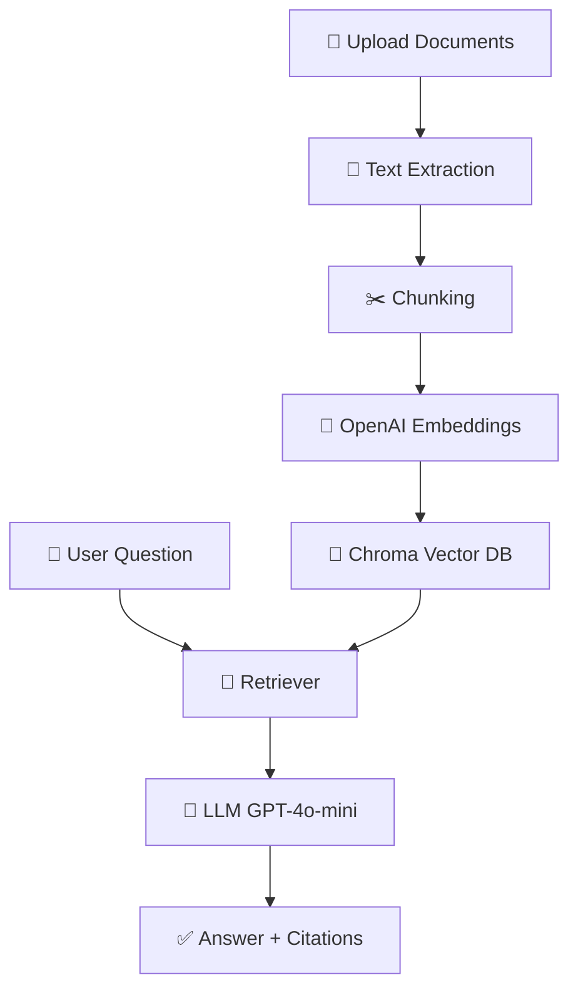

# 🧩 Internal Knowledge Copilot

AI assistant that answers questions about your **internal documents** (PDF, DOCX, TXT) with **concise, factual** responses and **source citations**.

Built with **Streamlit**, **LangChain**, **OpenAI (GPT-4o-mini + embeddings)**, and **Chroma**.

---

## ✨ Features

- 📂 Upload multiple files (PDF, DOCX, TXT)
- ✂️ Smart chunking for large documents
- 🔢 OpenAI embeddings (**text-embedding-3-small**)
- 💾 Vector store powered by **Chroma**
- 💬 GPT-4o-mini answers with **cited sources**
- 🖥️ Minimal Streamlit UI (Upload → Build → Ask → Answer)
- 🔐 Secrets via `.env` (local) or **Streamlit Secrets** (cloud)

---

## 🧱 Architecture



---

## 📦 Requirements

- Python 3.10+ (tested on 3.13)
- OpenAI API key
- OS: macOS / Windows / Linux

---

## 🔧 Installation (Local)

```bash
# 1) Clone the repo
git clone https://github.com/posiu/internal-knowledge-copilot.git
cd internal-knowledge-copilot

# 2) Create & activate a virtual environment
python3 -m venv .venv

# macOS/Linux:
source .venv/bin/activate

# Windows (PowerShell):
# .\.venv\Scripts\Activate.ps1

# 3) Install dependencies
pip install -r requirements.txt

# 4) Add your OpenAI key
# Create a .env file in the project root with:
# OPENAI_API_KEY=sk-xxxxxxxxxxxxxxxx
```

Run the app:

```bash
streamlit run app.py
```

Open: http://localhost:8501

---

## 📁 Project Structure

```
internal-knowledge-copilot/
├─ app.py                        # Streamlit UI (Upload → Build → Ask)
├─ utils/
│  ├─ loader.py                  # PDF/DOCX/TXT extraction
│  ├─ text_splitter.py           # Chunking long texts
│  ├─ vector_store.py            # Embeddings + Chroma persistence
│  └─ qa_chain.py                # RetrievalQA (custom prompt, GPT-4o-mini)
├─ data/
│  ├─ uploads/                   # Uploaded files (git-ignored)
│  └─ chroma_db_*                # Vector DB folders (git-ignored)
├─ .env                          # OPENAI_API_KEY (git-ignored)
├─ requirements.txt              # Python dependencies
├─ .gitignore                    # Ignore secrets, venv, local DB
└─ README.md
```

---

## 🛠️ Configuration

| Setting | Where | Example / Notes |
|---------|-------|-----------------|
| OPENAI_API_KEY | `.env` / Streamlit Secrets | `sk-...` |
| Embeddings model | `utils/vector_store.py` | `text-embedding-3-small` |
| LLM model | `utils/qa_chain.py` | `gpt-4o-mini`, temperature=0.0 |
| Chroma persist directory | `app.py` (session-specific) | `data/chroma_db_<random>` |
| Chunk size / overlap | `utils/text_splitter.py` | chunk_size=1500, chunk_overlap=200 |
| Top-k retrieved chunks | `utils/qa_chain.py` | retriever = ... (k=3) |

---

## 📚 Usage

1. Upload one or more files in the sidebar.
2. Click **🧠 Rebuild Knowledge Base**.
3. Ask a question in the main input.
4. Read the answer and sources listed below it.

**Tip:** Rebuilding creates a fresh Chroma database folder (unique per rebuild) to avoid file locks and duplication.

---

## 🔐 Secrets & Environment

### Local (.env)

Create `./.env`:

```ini
OPENAI_API_KEY=sk-xxxxxxxxxxxxxxxxxxxxxxxx
```

### Streamlit Cloud (Secrets)

Open **Manage app** → **Settings** → **Secrets** and add:

```toml
OPENAI_API_KEY = "sk-xxxxxxxxxxxxxxxxxxxxxxxx"
```

---

## ☁️ Deployment (Streamlit Cloud)

1. Push your repo to GitHub.

2. Go to https://share.streamlit.io/ and create a **New app**:
   - **Repo:** `posiu/internal-knowledge-copilot`
   - **Branch:** `main`
   - **Main file:** `app.py`

3. Add **Secrets**:
   ```toml
   OPENAI_API_KEY = "sk-xxxxxxxxxxxxxxxxxxxxxxxx"
   ```

4. **Deploy**. Your app will be available at your Streamlit subdomain (e.g. https://knowledge-base-copilot.streamlit.app).

---

## 🧩 Dependencies

Contents of `requirements.txt`:

```txt
# Core app & UI
streamlit>=1.37
python-dotenv>=1.0.1

# LangChain + OpenAI + Vector store
langchain>=0.2.11
langchain-community>=0.2.10
langchain-openai>=0.1.17
openai>=1.43.0
chromadb>=0.5.5
langchain-chroma>=0.1.1
tiktoken>=0.7.0

# File parsing
pypdf>=4.2.0
python-docx>=1.1.2

# Utilities
pandas>=2.2.2
```

---

## 🧪 Testing Checklist

- [ ] Upload 2–3 files (mix of PDF/DOCX/TXT).
- [ ] Rebuild knowledge base → expect a success message.
- [ ] Ask: "What is this document about?"
- [ ] Answer appears with sources (filenames or `filename (part N)`).
- [ ] Rebuild again after adding files → still works.

---

## 🧯 Troubleshooting

### "attempt to write a readonly database" (Chroma/SQLite)
- **Caused by:** File locks when deleting DB while Streamlit is running.
- **Fixed by:** Using a new unique `data/chroma_db_<id>` per rebuild (already implemented).

### BadRequest 400: "Requested XXXXX tokens, max 300000"
- **Your document is too large** in tokens for one request.
- **Solved by:** Chunking (already implemented in `text_splitter.py`).

### ModuleNotFoundError: langchain_chroma
- Ensure `langchain-chroma` is listed in `requirements.txt` and redeploy.

### No API key / Key not loaded
- **Local:** check `.env`.
- **Cloud:** check Secrets and use valid TOML:
  ```toml
  OPENAI_API_KEY = "sk-xxxx"
  ```

### Quota / Rate limits
- Verify usage & billing in the OpenAI dashboard.

---

## 🔒 Privacy & Security

- Uploaded files and vector DB are stored locally (and are git-ignored).
- On Streamlit Cloud, files live only in your app's sandbox.
- **Never commit** `.env`, `data/`, or `chroma_db_*` folders.

---

## 🗺️ Roadmap

- [ ] Chat history & multi-turn context
- [ ] Incremental updates (append-only embeddings)
- [ ] More formats (CSV, PPTX, HTML)
- [ ] Light/Dark mode toggle
- [ ] UI improvements
- [ ] On-prem vector DB options (PGVector, Milvus)
- [ ] Optional OSS embedding backends (HF)

---

## 🤝 Contributing

PRs welcome! Please open an issue to discuss major changes.

---

## 📜 License

MIT © 2025 posiu

---

## 🙏 Acknowledgements

- [Streamlit](https://streamlit.io/)
- [LangChain](https://www.langchain.com/)
- [Chroma](https://www.trychroma.com/)
- [OpenAI](https://openai.com/)
